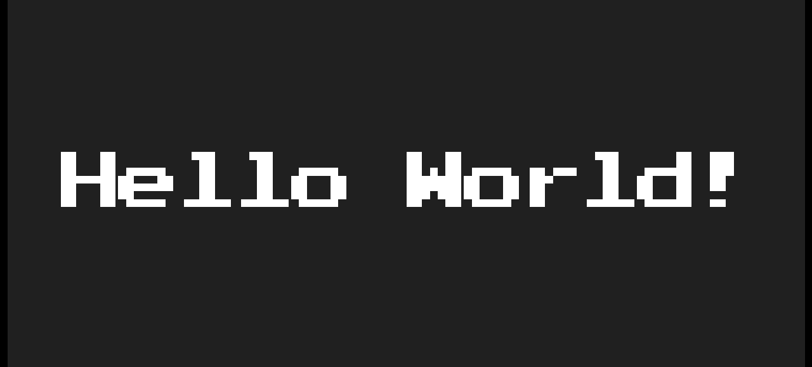

# Part 2: Setting up

**What you will learn:** how to create a melonJS project, and what the two lines
that start every game actually do.

## Create the project

Open a terminal, go to wherever you keep your projects, and run these four
commands one at a time:

```bash
npm create melonjs@latest my-game
cd my-game
npm install
npm run dev
```

The last one prints an address, usually `http://localhost:5173`.

## Make the assets load

Before you open that address, move the data folder. The starter keeps your
images and levels in `src/data`, but the development server does not serve them
from there, so the game cannot find its font:

```bash
mkdir public
mv src/data public/data
```

Now open `http://localhost:5173` in your browser.

**You should see:** the words `Hello World!` on a dark background.



That is a working melonJS game. Leave the terminal running. From now on, every
time you save a file the browser reloads by itself.

## Look around the project

Open the `my-game` folder in VS Code. There are a lot of files, and you can
ignore most of them. These are the ones that matter:

```plaintext
public/
  data/
    img/          images go here      (empty for now)
    map/          levels go here      (empty for now)
    fnt/          the font the starter uses
src/
  index.ts        starts the game
  manifest.ts     the list of files your game loads
  scripts/
    stage/play.ts           the screen your game runs on
    renderables/player.ts   your character
```

Two of those folders are empty. Part 3 fills them.

## The two lines that start a game

Open `src/index.ts` and find these lines near the top:

```ts
const app = new Application(1218, 562, { parent: "screen", scale: "auto" });

await app.init();
```

The first line creates your game. The second one builds the renderer and puts
the canvas on the page.

**Do not skip `await app.init()`.** It is required, and it is easy to forget
because nothing obviously breaks straight away. Without it your game has a world
but nothing to draw with, and the errors you get later will not mention it.

Further down, one more block is worth a look:

```ts
loader.preload(DataManifest, () => {
    state.set(state.PLAY, new PlayScreen());
    state.change(state.PLAY, false);
});
```

This says: load everything in the manifest, then switch to the play screen.
Nothing loads by itself in melonJS. If a file is not in `manifest.ts`, your game
cannot use it. That catches everybody once.

## Get the art and the level

You need a tileset and a map to build with. Rather than draw them now, copy them
from the melonJS examples:

```bash
git clone --depth 1 https://github.com/melonjs/melonJS
cp -r melonJS/packages/examples/public/assets/platformer/img/* my-game/public/data/img/
cp -r melonJS/packages/examples/public/assets/platformer/map/* my-game/public/data/map/
```

On Windows, copy the two folders in Explorer instead.

**You should now have:** `tileset.png`, `background.png`, `clouds.png`,
`texture.png` and `texture.json` in `public/data/img`, and `map1.tmx` with
`tileset.tsx` in `public/data/map`.

<a href="/tutorial/part-3-modifying-the-game" class="next">Up Next: Building the game</a>
